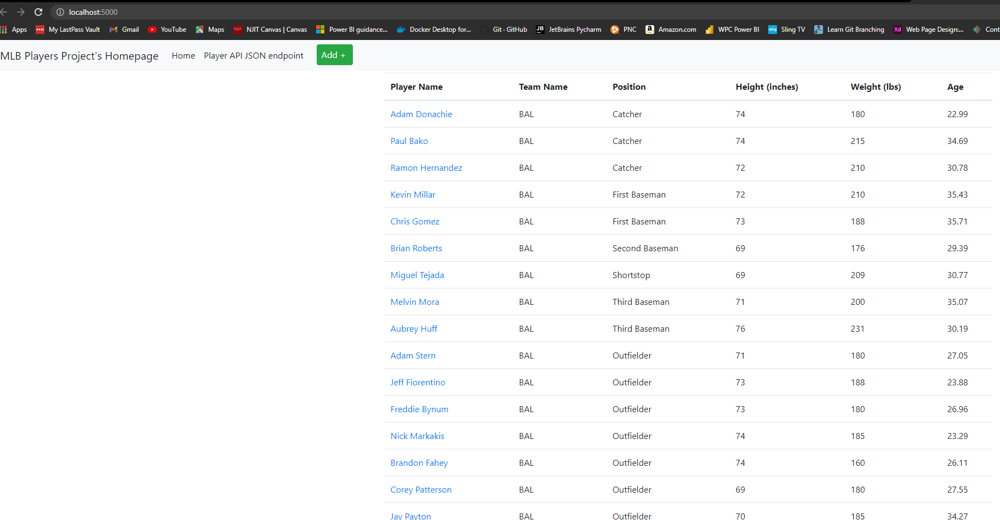

# IS 601 - Project 3
Please refer to my word document for showing screenshots working

## Project Description
This project's goal was to use a REST API and use Postman to test the GET, POST, PUT, and DELETE request methods.

The data was taken from [this](https://people.sc.fsu.edu/~jburkardt/data/csv/csv.html) csv source and converted to SQL statements using [this](https://sqlizer.io/#/) online tool.

## API Endpoint Testing using Postman
As the project was built, each API endpoint was manually tested using Postman. Download my word document for full screenshot results. 
Below is what my app looked like after launch:

Screenshot of 'localhost:5000/mlb-data'

